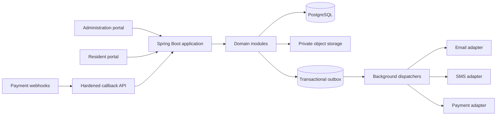

# Phase 0 — Java architecture

## Architecture style

Residence.io is a Java 21 Spring Boot 4.1 modular monolith with ports-and-adapters boundaries, built by Maven. It offers two Vaadin Flow 25 UI shells and a versioned REST surface for provider callbacks, exports, and future clients. PostgreSQL is the system of record; Spring Data JPA with Hibernate provides persistence and Flyway owns schema evolution.



## Modules

| Module | Responsibilities | May depend on |
|---|---|---|
| `identity` | Users, credentials, sessions, verification, 2FA, account lifecycle | audit, notification contracts |
| `access` | Roles, permissions, society membership, resource policies | identity identifiers |
| `society` | Society profile, locale, units, property structures, settings | access |
| `resident` | Residents, occupancy, household, vehicles, documents, ID cards | society, identity, files |
| `billing` | Fee plans, assignments, dues, ledger, payments, allocations, receipts, provider callbacks | resident, society, audit, outbox |
| `workforce` | Staff, salaries, workers, categories, availability | society, files, billing contracts |
| `complaint` | Complaints, confidentiality, messages, timeline and transitions | resident, access, files, notification contracts |
| `maintenance` | Requests, assignments, schedules, completion, rating and privacy-scoped disclosure | resident, workforce, files, notification contracts |
| `notification` | Templates, announcements, recipients, channel delivery, read state | outbox, files |
| `reporting` | Read models, bounded exports, PDF/CSV reports | module read contracts |
| `files` | Metadata, validation, scanning, access grants, signed retrieval | object-storage port, audit |
| `audit` | Append-only security and business audit records | none |
| `shared` | IDs, money, clocks, pagination, errors, validation primitives | none |

Module internals follow `domain`, `application`, `adapter.in`, and `adapter.out` packages. Direct cross-module table access is disallowed; application services use published module contracts or reporting projections.

## Runtime components

- Spring Security: form login/session cookies, password hashing, CSRF, method authorization and route guards.
- Spring Data JPA: aggregate persistence; native SQL only for locking, reporting, and performance-sensitive projections.
- Flyway: forward-only, reviewed schema migrations.
- Vaadin Flow: Java-authored responsive screens, server-side validation and accessible components.
- Jakarta Bean Validation: input and domain-boundary validation.
- Quartz or Spring scheduling with database coordination: due generation, reminders, escalation and cleanup.
- Transactional outbox dispatcher: at-least-once delivery with idempotent consumers.
- OpenAPI: callback and integration endpoints.
- Apache PDFBox and ZXing adapters: server-rendered receipts, cards, slips, reports and QR codes.
- Spring Boot Actuator: health, readiness, metrics and operational monitoring.
- JUnit 5, Mockito, Spring Boot Test, Testcontainers and Selenium: automated verification layers.

## Security model

1. Authenticate the session and validate account status, expiry, password-change and 2FA requirements.
2. Resolve active society membership and permissions.
3. Apply use-case permission checks in application services.
4. Apply resource policies: same society, resident owns record, assignment permits worker disclosure, or sensitive-complaint grant exists.
5. Query through society-scoped repositories; never accept a client-supplied society as authority.
6. Audit allowed and denied sensitive actions with actor, target, result, correlation ID and safe change metadata.

Sessions use secure, HTTP-only, same-site cookies. Administrative session lifetime is shorter than resident lifetime and re-authentication is required for security settings, reversals, exports of sensitive data, and 2FA changes.

## Provider ports

```java
interface EmailGateway { DeliveryResult send(EmailMessage message); }
interface SmsGateway { DeliveryResult send(SmsMessage message); }
interface PaymentGateway { PaymentIntent create(PaymentRequest request); VerificationResult verify(ProviderEvent event); }
interface ObjectStorage { StoredObject put(Upload upload); SignedAccess authorize(ObjectKey key, Duration ttl); }
interface MalwareScanner { ScanResult scan(InputStream content); }
interface PdfRenderer { RenderedDocument render(DocumentTemplate template, Map<String, Object> model); }
```

Provider implementations are selected by society configuration but secrets are referenced through deployment secret keys, never stored in clear text settings.

## Data and transaction boundaries

- One transaction posts a payment, allocations, ledger entries, receipt eligibility, audit entry, and outbox event.
- Payment callbacks lock the payment attempt by provider and external event ID; duplicate events return the stored result.
- Monthly due generation uses a unique `(society_id, resident_id, charge_period, charge_type)` constraint and retry-safe jobs.
- Human-readable IDs use a locked society-scoped counter row and a unique final identifier.
- File bytes are outside PostgreSQL; database rows contain metadata, classification, owner and storage key.
- Reporting uses read-only projections; high-volume exports run asynchronously and expire.

## Source layout planned for Phase 1

```text
pom.xml
src/main/java/io/residence/
  ResidenceApplication.java
  shared/
  identity/
  access/
  society/
  resident/
  billing/
  workforce/
  complaint/
  maintenance/
  notification/
  reporting/
  files/
  audit/
  ui/admin/
  ui/resident/
src/main/resources/
  application.yml
  db/migration/
src/test/java/io/residence/
docs/
```

## Deployment baseline

- Executable Spring Boot JAR or Docker image behind a TLS-terminating reverse proxy/load balancer.
- Managed PostgreSQL with point-in-time recovery and verified encrypted backups.
- Private S3-compatible bucket with lifecycle rules and server-side encryption.
- Separate development, test, staging and production configuration; secrets supplied by the hosting platform.
- Health/readiness endpoints, structured logging, metrics and alerting.

Hosting selection remains open because no target platform or operational constraints were supplied.
