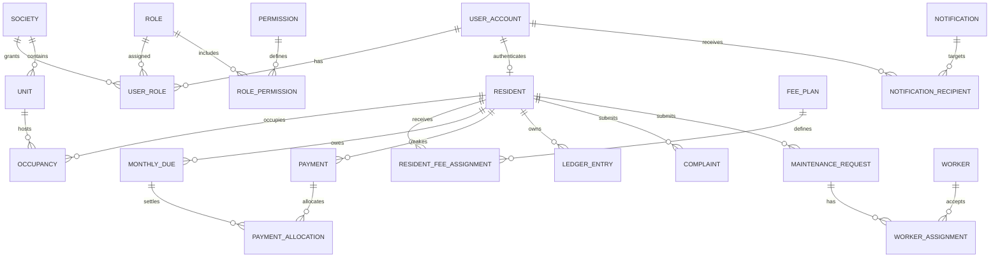

# Phase 0 — Normalized data model

All business tables include `id uuid`, `created_at`, `created_by`, `updated_at`, `updated_by`, and `version` unless explicitly append-only. Society-owned records include `society_id`. Currency amounts are `numeric(19,4)` with `currency char(3)`. Times are UTC instants; business dates are `date` and are interpreted using the society time zone.

## Entity groups

### Identity and access

| Entity | Important fields and constraints |
|---|---|
| `society` | unique slug; name, zone, currency, status, locale/format settings |
| `user_account` | unique normalized username; email/phone indexes; password hash; lifecycle status; force-change; lock and verification fields |
| `user_session` | user, token hash, issued/last-seen/expires/revoked, device/IP metadata |
| `role` | society nullable for system roles; unique `(society_id, code)`; custom flag |
| `permission` | globally unique code |
| `role_permission` | unique `(role_id, permission_id)` |
| `user_role` | society membership and role; unique `(society_id, user_id, role_id)` |
| `mfa_factor` | encrypted secret reference, type, verified/revoked timestamps |
| `password_reset_token` | hashed token, single-use expiry |

### Property and residents

| Entity | Important fields and constraints |
|---|---|
| `property` | society, block, street, type; unique normalized address key |
| `unit` | property, unit number, parking metadata; unique `(property_id, normalized_unit_no)` |
| `resident` | user, atomic resident number, profile/contact/demographic fields, status, archived_at; unique `(society_id, resident_no)` and user association |
| `occupancy` | resident, unit, owner/tenant role, start/end, primary flag; exclusion/business constraint prevents conflicting active primary occupancy |
| `tenancy` | occupancy, owner details, start/end, agreement document |
| `household_member` | resident, name, relationship and optional contact/identity fields |
| `vehicle` | resident, plate, type/model/color; unique active plate per society |
| `resident_document` | resident, document type, file attachment, masked identity and encrypted/search-hash references, verification status |
| `resident_id_card` | resident, card number, issue/expiry, verification token hash, template version, revoked/regenerated reason; unique card number |

### Billing and payments

| Entity | Important fields and constraints |
|---|---|
| `fee_plan` | society, code, charge rules, property/unit criteria, active dates; unique `(society_id, code, effective_from)` |
| `resident_fee_assignment` | resident, plan, amount snapshot/rule, effective range; no overlapping assignment for the same charge type |
| `monthly_due` | resident, charge period, due date, original amount, status; unique generation key |
| `ledger_entry` | append-only resident account posting: debit/credit, type, amount, effective date, source type/id, reversal reference |
| `payment` | resident, method, provider, external reference, amount, status, received/confirmed timestamps, idempotency key |
| `payment_attempt` | payment, provider intent/event identifiers, state and safe response metadata; unique provider event ID |
| `payment_allocation` | payment, due, amount; unique `(payment_id, due_id)` and sum cannot exceed confirmed payment |
| `payment_adjustment` | resident, reason, permission evidence, amount/type, source/reversal references |
| `receipt` | confirmed payment, immutable number, issued time, template version, file; unique `(society_id, receipt_no)` |
| `fee_rule` | due/grace/late/tax rule with effective range and immutable version |

Balances are derived from append-only `ledger_entry` rows. `monthly_due.status` is a maintained projection and is never the financial source of truth.

### Workforce and service

| Entity | Important fields and constraints |
|---|---|
| `staff_member` | society, staff number, profile/employment fields, salary terms, archived_at; unique staff number |
| `staff_document` | staff, type, file, verification status |
| `salary_record` | staff, period, gross/net/paid, status; unique `(staff_id, salary_period)` |
| `salary_payment` | salary record, amount, method/reference, paid time, reversal reference |
| `worker_category` | society, code/name, active; unique category code |
| `worker` | society, worker number, internal/external, profile, availability, service area, rate notes, status |
| `worker_skill` | unique worker/category association with proficiency metadata |

### Complaints and maintenance

| Entity | Important fields and constraints |
|---|---|
| `complaint` | ticket no, resident, category, priority, confidentiality, status, assigned admin, resolution/close/reopen data |
| `complaint_message` | complaint, author, visibility (`RESIDENT`/`INTERNAL`), message |
| `complaint_event` | append-only status/assignment/message/audit timeline |
| `maintenance_request` | ticket no, resident, category, preferred/scheduled visit, access instructions, urgency, admin priority, status, completion/rating |
| `maintenance_message` | request, author, visibility, message |
| `worker_assignment` | request, worker, schedule, active window, disclosure snapshot, status; one active assignment per request |
| `maintenance_event` | append-only complete request timeline |

### Notification, files and audit

| Entity | Important fields and constraints |
|---|---|
| `notification_template` | society, code, channel, locale, version, subject/body, active |
| `notification` | type/category/priority, payload snapshot, publish/expiry/schedule, source reference |
| `notification_recipient` | notification, recipient/audience resolution, channel, delivery/read states; unique deduplication key |
| `notification_delivery_attempt` | recipient, provider, attempt, status, safe response, next retry |
| `announcement` | authored content, audience rule snapshot, attachment and lifecycle; links to generated notification |
| `file_attachment` | owner type/id, classification, object key, name, media type, size, checksum, scan state, archived_at |
| `audit_log` | append-only actor, society, action, target, outcome, reason, IP/device/correlation and redacted changes |
| `system_setting` | society nullable, typed key, encrypted/reference value where needed, effective/version fields; unique active key scope |
| `outbox_event` | aggregate, event type, payload, dedupe key, available/processed/failed fields |
| `number_sequence` | society, sequence type/year, next value; unique scope and row-locked allocation |

## Relationship overview

## Required indexes and integrity controls

- Composite society/status indexes for every admin list; normalized search columns for names, usernames, IDs, phone and units.
- Partial indexes for active residents, occupancies, assignments, unread notifications, open tickets and pending deliveries.
- Unique provider event and idempotency keys.
- Check constraints for non-negative source amounts, valid date ranges, ratings, allocation amounts and compatible statuses.
- PostgreSQL exclusion constraints or serializable service checks for non-overlapping active occupancy and fee assignments.
- Foreign keys default to `RESTRICT`; archival retains referenced data. Cascades are limited to disposable child rows before business activation.
- Audit, timeline, ledger and delivery-attempt tables prohibit application update/delete operations.
