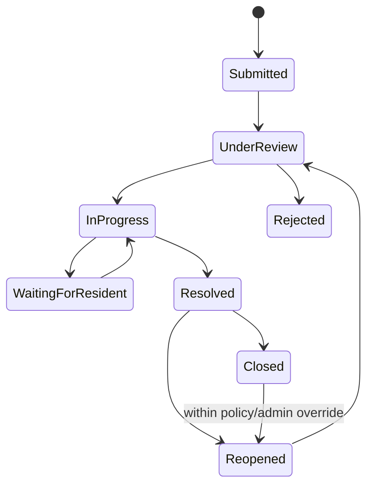
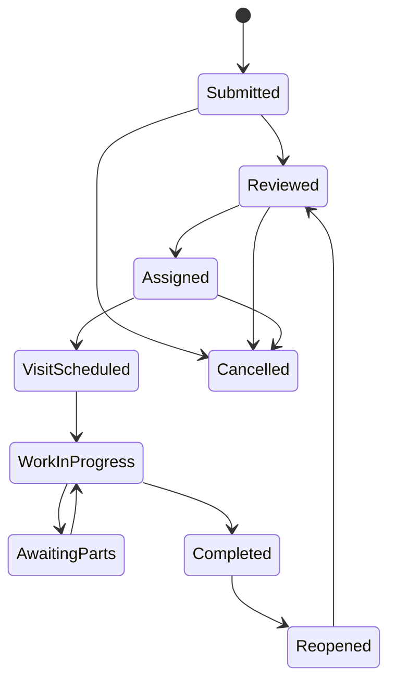

# Phase 0 — Route map and workflows

## UI route map

### Public and account routes

| Route | Purpose |
|---|---|
| `/login` | Login with lockout-safe error handling |
| `/forgot-password` | Request a reset without account enumeration |
| `/reset-password/{token}` | Single-use password reset |
| `/first-login` | Forced password change and optional verification/2FA setup |
| `/verify/card/{code}` | Minimal resident ID-card validity check |

### Administration portal

| Route group | Screens |
|---|---|
| `/admin/dashboard` | KPIs, filters, charts, activity and quick actions |
| `/admin/residents` | List/search/filter/export; add; detail/profile; documents; ID card |
| `/admin/payments` | Resident payment table; ledger; record/verify/adjust/reverse; receipts |
| `/admin/staff` | Staff list/profile, salary records/payments/slips |
| `/admin/workers` | Worker list/profile, categories, skills and availability |
| `/admin/notifications` | Payment reminders, audience preview, templates, schedules and delivery logs |
| `/admin/announcements` | Create, target, publish, expire and delivery/read reporting |
| `/admin/complaints` | Queue, detail, assignment, internal/resident messages and timeline |
| `/admin/maintenance` | Queue, detail, scheduling, assignment, status and timeline |
| `/admin/reports` | Domain reports, filters, asynchronous export and download |
| `/admin/settings/*` | Society, finance, users/roles, notifications, service, ID/document, system/audit |

### Resident portal

| Route | Screen |
|---|---|
| `/portal` | Dashboard, balances, charts, current activity and quick actions |
| `/portal/payments` | Dues selection, payment initiation/proof, history and receipts |
| `/portal/notifications` | Search/filter/read center and attachments |
| `/portal/maintenance` | List, submit, detail, messages, completion/reopen/rating |
| `/portal/complaints` | List, submit, detail, follow-up, resolution/reopen |
| `/portal/profile` | Profile, unit, household, vehicle, documents, ID card, preferences, password/sessions/activity |

Integration endpoints use `/api/v1/integrations/payments/{provider}/webhook`; health and documentation endpoints are separately secured. Resource APIs never expose unrestricted entity repositories.

## Status transitions

### Account

`INVITED -> ACTIVE -> SUSPENDED -> ACTIVE`; `ACTIVE|SUSPENDED -> DEACTIVATED`; any retained record may become `ARCHIVED`. First login gates normal access until the temporary password is changed. Only authorized administrators reactivate; archival never deletes history.

### Payment

`CREATED -> PENDING -> CONFIRMED` or `FAILED|CANCELLED`; uncertain callbacks may enter `UNDER_REVIEW`. A confirmed payment is never edited. `CONFIRMED -> REVERSED` is represented by a privileged compensating transaction and retains the original.

### Monthly due projection

`PENDING -> PARTIALLY_PAID -> PAID`; due day plus grace expiry may change an unpaid projection to `OVERDUE`; authorized entries can produce `WAIVED` or `UNDER_REVIEW`. Status is recalculated from ledger facts.

### Complaint

Every transition requires actor, timestamp and visible/internal note policy. Rejection, closure and administrative reopen require a reason.

### Maintenance

Worker reassignment closes the prior assignment and creates a new one. Completion records worker input; resident confirmation/rating is a separate event. Timed auto-close, if enabled, must be configurable.

### Notification delivery

Recipient lifecycle is `SCHEDULED -> QUEUED -> SENT -> DELIVERED` where supported, with `FAILED` retry attempts and terminal `UNDELIVERABLE`. In-app read lifecycle is independently `UNREAD -> READ`. Retrying creates attempts and never erases failure history.

## Ledger and allocation rules

1. Generate each due from the fee assignment effective on its charge period and snapshot fee/tax/late rule versions.
2. Post charges as debits and confirmed payments/waivers as credits. Balances are the signed sum of posted entries.
3. For selected-month payment, allocate in the resident's selected order, validated against open dues.
4. Otherwise allocate by oldest due date, then charge creation timestamp, then stable ID.
5. Apply allocation to base charge before late fee unless the society policy explicitly changes the priority.
6. Partial allocations leave the due partially paid. Excess payment posts to advance credit and can be consumed only through an auditable allocation.
7. A payment and all of its postings/allocations commit atomically. A failed commit issues no receipt.
8. A confirmed payment reversal posts equal opposite entries, releases allocations, marks the original as reversed, and records actor/reason/approval. It never mutates the original amounts.
9. Every provider request and callback carries an idempotency/deduplication key. Replays return the previously stored outcome.
10. Refund support is distinct from reversal and remains a future provider operation unless explicitly approved.

## Scheduled work

- Monthly due generation: society-zone schedule, retry-safe unique generation key.
- Payment reminders: calculate audience from current ledger projection at execution time, then snapshot recipients.
- Announcement publishing/expiry: society-zone times converted to UTC.
- SLA escalation: rule-driven complaint/maintenance checks.
- Delivery retry: bounded exponential backoff with terminal failure.
- Session/token/export cleanup and retention: configured, audited and safe to rerun.
